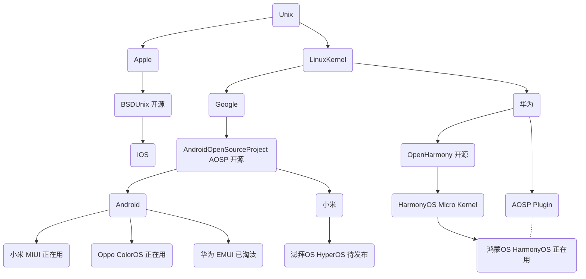

```mermaid
flowchart TB
	Unix(Unix) --> Linux(LinuxKernel)
	
	Unix --> Apple(Apple)
	Apple --> BSD(BSDUnix 开源)
	BSD --> iOS(iOS)
	
	Linux --> Google(Google)
	Google --> AOSP(AndroidOpenSourceProject AOSP 开源)
	AOSP --> Android(Android)
	AOSP --> Mi(小米)
	Mi --> HyperOS(澎拜OS HyperOS 待发布)
	Android --> MIUI(小米 MIUI 正在用)
	Android --> ColorOS(Oppo ColorOS 正在用)
	Android --> EMUI(华为 EMUI 已淘汰)

	Linux --> Huawei(华为)
	Huawei --> OpenHarmony(OpenHarmony 开源)
	Huawei --> AOSPPlugin(AOSP Plugin)
	OpenHarmony --> HarmonyMicro(HarmonyOS Micro Kernel)
	HarmonyMicro --> HarmonyOS(鸿蒙OS HarmonyOS 正在用)
	AOSPPlugin -.- HarmonyOS
```
