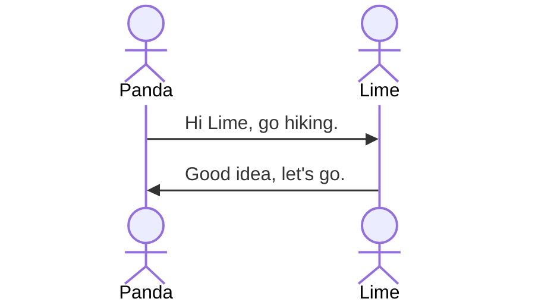

# Markdown Format

## Headline2
### Headline3
#### Headline4
##### Headline5
###### Headline6

## Styling Text
**Bold text**
*Italic text*
**Bold and *nested italic* bold**
***All bold and italic***
~~Strikethrough text~~
<u>Underline text</u>
==Highlight text==
This is a <sub>subscript</sub> text
This is a <sup>superscript</sup> text

### Code Fence
This is `inline code` fence.
``` python
a = 'code fence'
print(a)
```

### Mermaid


### Links
External link [About Mermaid | Mermaid](https://mermaid.js.org/intro/)
Internal link [[念奴娇.赤壁怀古]]
Internal image link 

### Quote Text
> Quote
> This is quote text

### Lists
- Gold
- Silver
- Bronze

1. First
2. Second
3. Third

- [ ] Task A
- [ ] Task B

## HTML
<a href="https://www.w3school.com.cn/tags/tag_a.asp">hyper link - html tags</a>

force<br>return<br>

<details>
  <summary>打开和关闭详细信息</summary>
  <p>标签通常用于创建用户可以打开和关闭的交互式小部件。默认情况下，小部件是关闭的。打开时，它会展开并显示其中的内容。</p>
</details>

 
 <div class="news">
  <h2>新闻头条 1</h2>
  <p>一些文字。一些文字。一些文字...</p>
  ...
</div>

<span style="font-family:default; font-size:default; color:red">red default font</span>
<span style="font-family:verdana; font-size:30px; color:blue">blue 30px verdana font</span>
<span style="background-color:lime;color:black">Yellow background</span>
Inline <span style="color:red; background-color:yellow">red yellow</span> text

<p>Paragraph 1</p>
<p>Paragraph 2</p>
<p>Paragraph 3</p>

## Latex
$\sum_{i=0}^n i^2 = \frac{(n^2+n)(2n+1)}{6}$

$m_蜡 = ρ_蜡gv_排$
$V_蜡 = V_1 - V_0$

$f = \sqrt \frac{2 \pi}{T}$

$f = \frac{2 \pi}{T}$

× ÷ + −

± ∞ ∆ ≤ ≥ ≌ ≠ º ∠ ⊥

一元二次方程 $ax^2+bx+c=0$ 中两根有如下关系 $x_{1}+x_{2}=-\frac{b}{a}, x_{1}x_{2}=\frac{c}{a}$

[MathJax basic tutorial and quick reference - Mathematics Meta Stack Exchange](https://math.meta.stackexchange.com/questions/5020/mathjax-basic-tutorial-and-quick-reference)
[The TeX/LaTeX Extension List — MathJax 3.2 documentation](https://docs.mathjax.org/en/latest/input/tex/extensions/index.html)

## Color
[HTML 颜色名 (w3school.com.cn)](https://www.w3school.com.cn/tags/html_ref_colornames.asp)

### Blue

| <span style="color:blue"> [blue] </span>             | <span style="background-color:black;color:blue"> [blue] </span>             | <span style="background-color:blue;color:white"> [blue] </span>             |
| ---------------------------------------------------- | --------------------------------------------------------------------------- | --------------------------------------------------------------------------- |
| <span style="color:lightblue"> [lightblue] </span>   | <span style="background-color:black;color:lightblue"> [lightblue] </span>   | <span style="background-color:lightblue"> [lightblue] </span>               |
| <span style="color:mediumblue"> [mediumblue] </span> | <span style="background-color:black;color:mediumblue"> [mediumblue] </span> | <span style="background-color:mediumblue;color:white"> [mediumblue] </span> |
| <span style="color:darkblue"> [darkblue] </span>     | <span style="background-color:black;color:darkblue"> [darkblue] </span>     | <span style="background-color:darkblue;color:white"> [darkblue] </span>     |
| <span style="color:aqua"> [aqua] </span>             | <span style="background-color:black;color:aqua"> [aqua] </span>             | <span style="background-color:aqua"> [aqua] </span>                         |
| <span style="color:cyan"> [cyan] </span>             | <span style="background-color:black;color:cyan"> [cyan] </span>             | <span style="background-color:cyan"> [cyan] </span>                         |
| <span style="color:skyblue"> [skyblue] </span>       | <span style="background:black;color:skyblue"> [skyblue] </span>             | <span style="background-color:skyblue"> [skyblue] </span>                   |
| <span style="color:navy">navy</span>                 | <span style="background-color:black;color:navy">navy</span>                 | <span style="background-color:navy;color:white">navy</span>                 |

### Brown

| <span style="color:brown"> [brown] </span>         | <span style="background-color:black;color:brown"> [brown] </span>              | <span style="background-color:brown;color:white"> [brown] </span>  |
| -------------------------------------------------- | ------------------------------------------------------------------------------ | ------------------------------------------------------------------ |
| <span style="color:chocolate"> [chocolate] </span> | <span style="background-color:black;color:chocolate"> [chocolate text] </span> | <span style="background-color:chocolate"> [chocolate text] </span> |

### Gray

| <span style="color:gray">gray</span>           | <span style="background-color:black;color:gray">gray</span>           | <span style="background-color:gray">gray</span>           |
| ---------------------------------------------- | --------------------------------------------------------------------- | --------------------------------------------------------- |
| <span style="color:lightgray">lightgray</span> | <span style="background-color:black;color:lightgray">lightgray</span> | <span style="background-color:lightgray">lightgray</span> |
| <span style="color:darkgray">darkgray</span>   | <span style="background-color:black;color:darkgray">darkgray</span>   | <span style="background-color:darkgray">darkgray</span>   |
| <span style="color:silver">silvertext</span>   | <span style="background-color:black;color:silver">silvertext</span>   | <span style="background-color:silver">silvertext</span>   |

### Green

| <span style="color:green">green</span>             | <span style="background-color:black;color:green">green</span>             | <span style="background-color:green;color:white">green</span>          |
| -------------------------------------------------- | ------------------------------------------------------------------------- | ---------------------------------------------------------------------- |
| <span style="color:lightgreen">lightgreen</span>   | <span style="background-color:black;color:lightgreen">lightgreen</span>   | <span style="background-color:lightgreen">lightgreen</span>            |
| <span style="color:darkgreen">darkgreen</span>     | <span style="background-color:black;color:darkgreen">darkgreen</span>     | <span style="background-color:darkgreen; color:white">darkgreen</span> |
| <span style="color:lime">lime</span>               | <span style="background-color:black;color:lime">lime</span>               | <span style="background-color:lime">lime</span>                        |
| <span style="color:limegreen">limegreen</span>     | <span style="background-color:black;color:limegreen">limegreen</span>     | <span style="background-color:limegreen">limegreen</span>              |
| <span style="color:olive">olive</span>             | <span style="background-color:black;color:olive">olive</span>             | <span style="background-color:olive;color:white">olive</span>          |
| <span style="color:yellowgreen">yellowgreen</span> | <span style="background-color:black;color:yellowgreen">yellowgreen</span> | <span style="background-color:yellowgreen">yellowgreen</span>          |

### Purple

| <span style="color:purple">purple</span>             | <span style="background-color:black;color:purple">purple</span>             | <span style="background-color:purple;color:white">purple</span>             |
| ---------------------------------------------------- | --------------------------------------------------------------------------- | --------------------------------------------------------------------------- |
| <span style="color:mediumpurple">mediumpurple</span> | <span style="background-color:black;color:mediumpurple">mediumpurple</span> | <span style="background-color:mediumpurple;color:white">mediumpurple</span> |
| <span style="color:orchid">orchid</span>             | <span style="background-color:black;color:orchid">orchid</span>             | <span style="background-color:orchid;color:white">orchid</span>             |
| <span style="color:violet">violet</span>             | <span style="background-color:black;color:violet">violet</span>             | <span style="background-color:violet">violet</span>                         |
| <span style="color:darkviolet">darkviolet</span>     | <span style="background-color:black;color:darkviolet">darkviolet</span>     | <span style="background-color:darkviolet;color:white">darkviolet</span>     |

### Red

| <span style="color:red">red</span>         | <span style="background-color:black;color:red">red</span>         | <span style="background-color:red;color:white">red</span>         |
| ------------------------------------------ | ----------------------------------------------------------------- | ----------------------------------------------------------------- |
| <span style="color:darkred">darkred</span> | <span style="background-color:black;color:darkred">darkred</span> | <span style="background-color:darkred;color:white">darkred</span> |
| <span style="color:magenta">magenta</span> | <span style="background-color:black;color:magenta">magenta</span> | <span style="background-color:magenta">magenta</span>             |
| <span style="color:pink">pink</span>       | <span style="background-color:black;color:pink">pink</span>       | <span style="background-color:pink">pink</span>                   |

### Yellow

| <span style="color:yellow">yellow</span>         | <span style="background-color:black;color:yellow">yellow</span>         | <span style="background-color:yellow">yellow</span>         |
| ------------------------------------------------ | ----------------------------------------------------------------------- | ----------------------------------------------------------- |
| <span style="color:gold">gold</span>             | <span style="background-color:black;color:gold">gold</span>             | <span style="background-color:gold">gold</span>             |
| <span style="color:orange">orange</span>         | <span style="background-color:black;color:orange">orange</span>         | <span style="background-color:orange">orange</span>         |
| <span style="color:darkorange">darkorange</span> | <span style="background-color:black;color:darkorange">darkorange</span> | <span style="background-color:darkorange">darkorange</span> |

## Callouts
> [!note] 
> note note 

> [!info] 
> info info 

> [!todo] 
> - [ ] Task 1

> [!abstract] 
> Abstract

> [!summary] 
> Summary 

> [!tip] 
> Tips 

> [!important] 
> Important 

> [!success] 
> Success 

> [!done] 
> Done 

> [!question] 
> Questions 

> [!help] 
> Help 

> [!faq] 
> FAQ 

> [!warning] 
> Warning 

> [!failure] 
> Failure 

> [!error] 
>  Error

> [!bug] 
> Bugs 

> [!example] 
> Example 

> [!quote] 
> Quote 

## Page Breaker
```html
<div STYLE="page-break-after: always;"></div>
```

