Table of Content
- [[#Flowchart|Flowchart]]
	- [[#Flowchart#Directions|Directions]]
	- [[#Flowchart#Nodes|Nodes]]
	- [[#Flowchart#Links|Links]]
	- [[#Flowchart#Organization|Organization]]
	- [[#Flowchart#Multiple Nodes Links|Multiple Nodes Links]]
	- [[#Flowchart#Flowcharts|Flowcharts]]

[Tutorials | Mermaid](http://mermaid.js.org/config/Tutorials.html)
[About Mermaid | Mermaid](http://mermaid.js.org/intro/)
[Mermaid | Diagramming and charting tool](http://mermaid.js.org/#/)
[Diagram Syntax | Mermaid](http://mermaid.js.org/intro/syntax-reference.html)

## Flowchart

### Directions
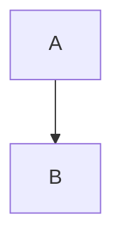

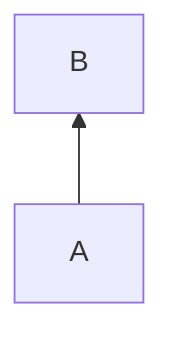

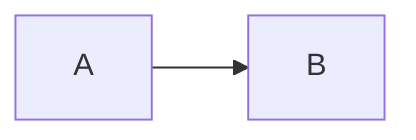

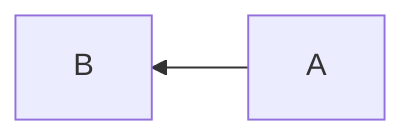

### Nodes
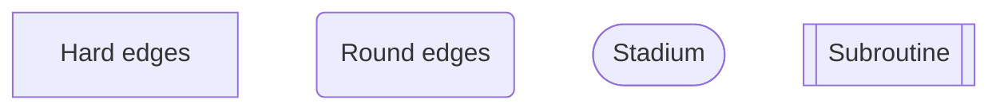

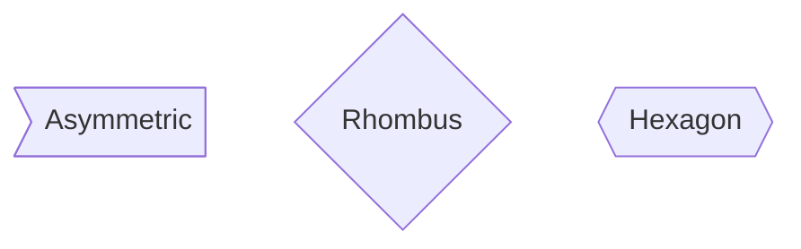

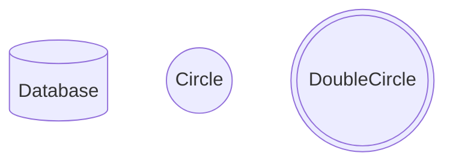

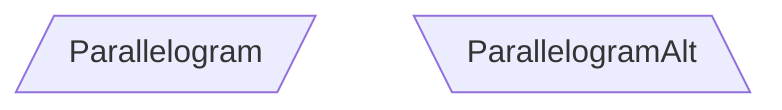

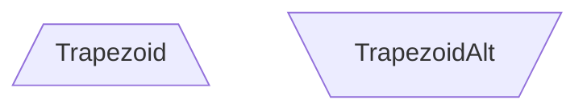

### Links
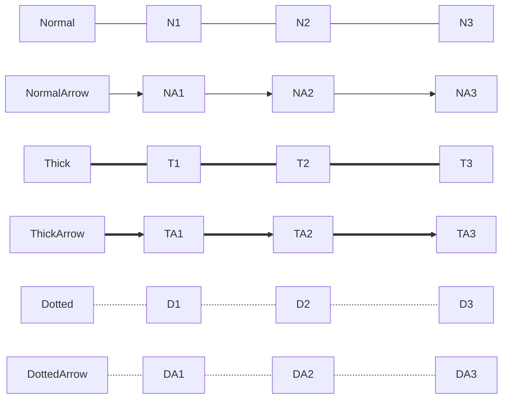

### Organization
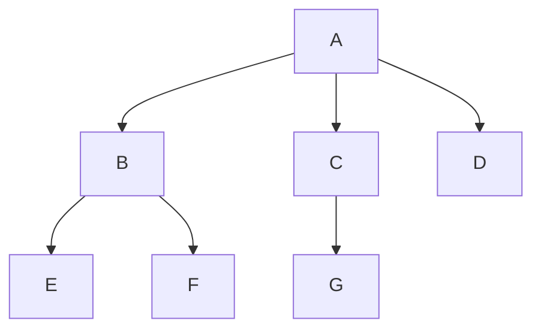

### Multiple Nodes Links
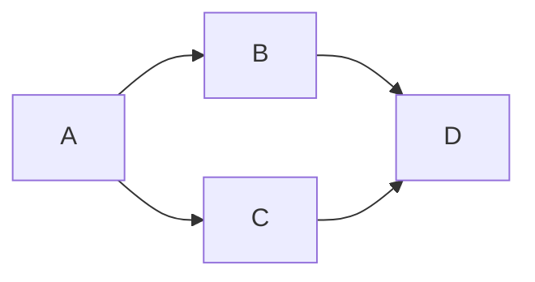

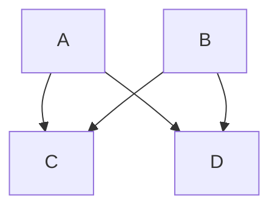

### Flowcharts
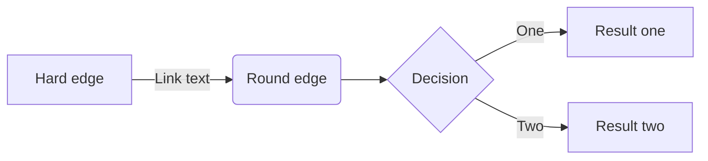

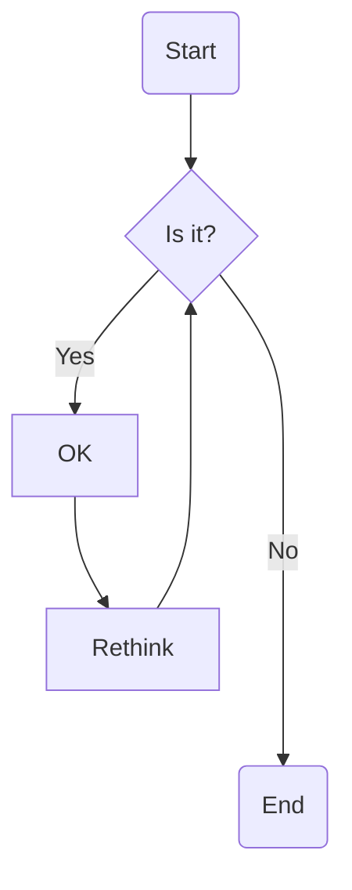

## Sequence Diagram
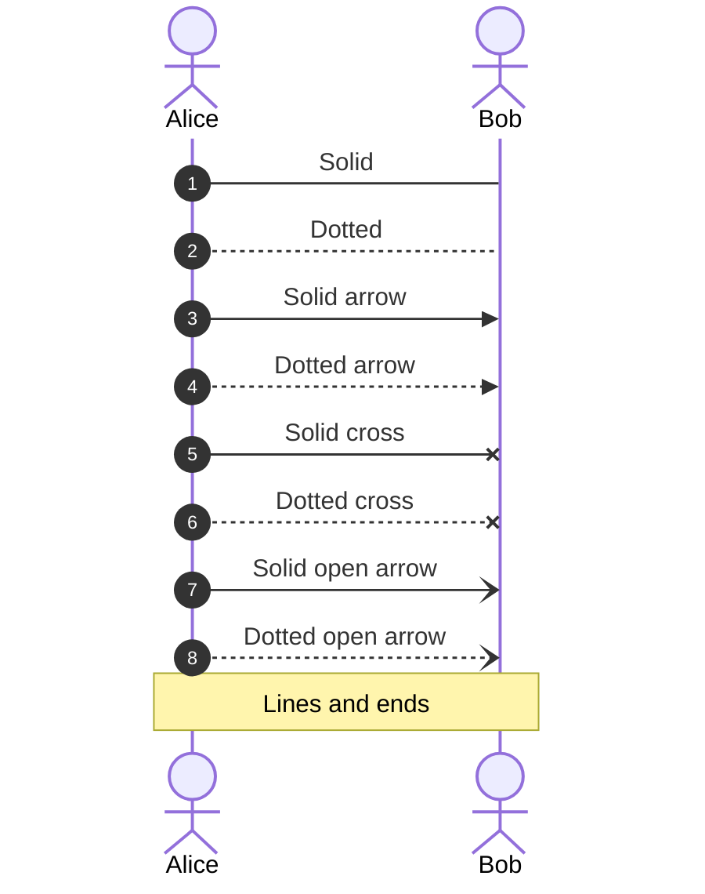

